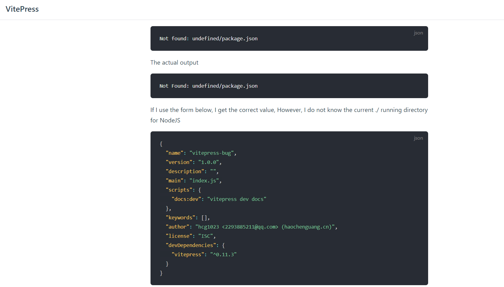

```markdown
I'm using
<<< @/package.json

The actual output
Not Found: undefined/package.json

If I use the form below, I get the correct value, However, I do not know the current ./ running directory for NodeJS

<<< ./package.json
```

